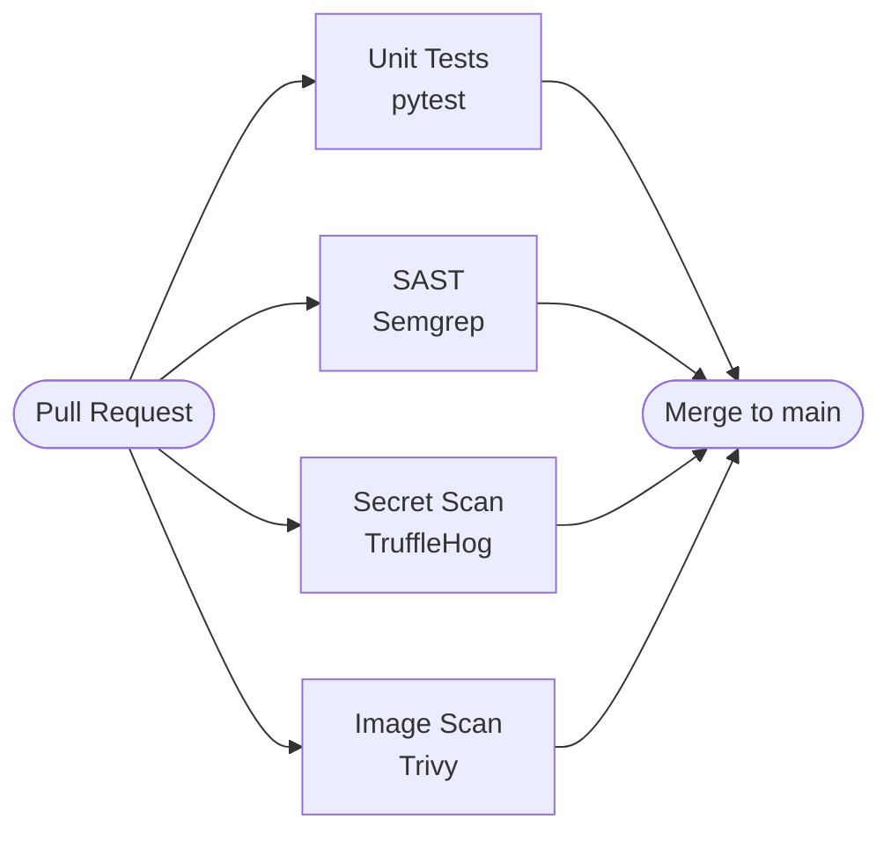

# zero-trust-devsecops

A minimal Flask API hardened with a zero-trust CI pipeline. Every pull request
to `main` must pass four automated security gates before a merge is allowed:
unit tests verify correctness, Semgrep catches security anti-patterns in source
code, TruffleHog scans the full git history for leaked credentials, and Trivy
blocks container images that carry known HIGH or CRITICAL CVEs — all with
least-privilege GitHub tokens and SHA-pinned actions to prevent supply-chain
tampering.

---

## CI Pipeline

All four jobs run in parallel. Every one must pass — any failure blocks merge.

---

## Security Checks

| Check | Tool | What it catches |
|---|---|---|
| **Unit Tests** | pytest | Regressions, broken endpoints, bad input-validation logic |
| **SAST** | Semgrep (`--config auto`) | Hardcoded secrets, injection sinks, insecure patterns in Python source |
| **Secret Scan** | TruffleHog (`--only-verified`) | Verified leaked credentials anywhere in the full git commit history |
| **Image Scan** | Trivy (`HIGH,CRITICAL`) | Known CVEs in OS packages and Python dependencies inside the Docker image |

---

## Known Limitations

- **No keyless auth yet.** AWS OIDC-based keyless authentication is planned but not implemented; the pipeline currently uses no cloud credentials at all (local build only).
- **False positives.** Semgrep and TruffleHog can flag findings that are not genuine vulnerabilities; each alert should be reviewed before suppressing.
- **CVE database coverage.** Trivy only detects *known* CVEs present in its advisory database — zero-day or unpublished vulnerabilities will not be caught.
